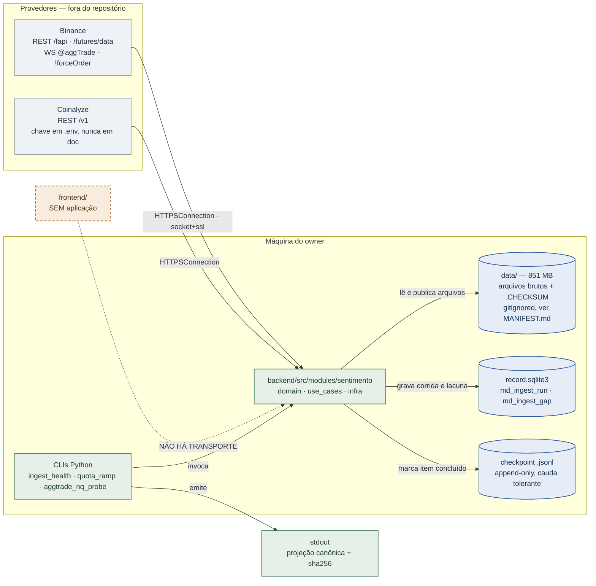
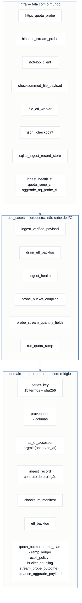
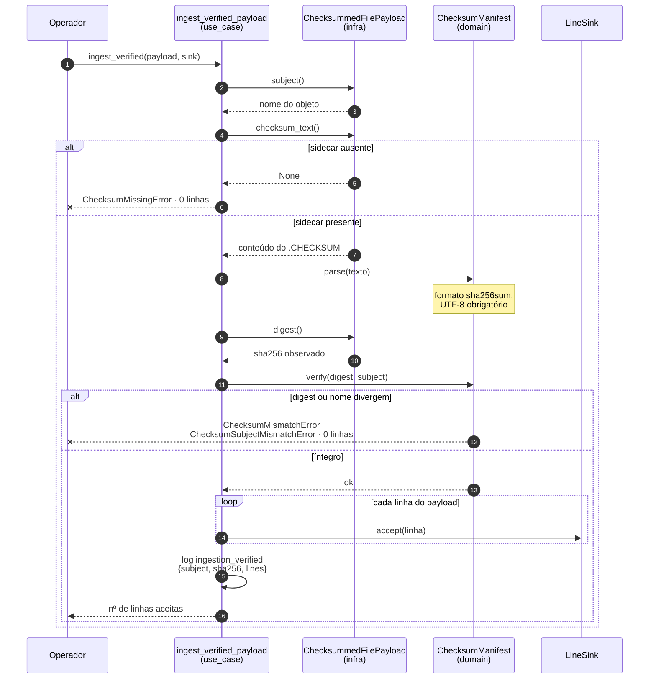
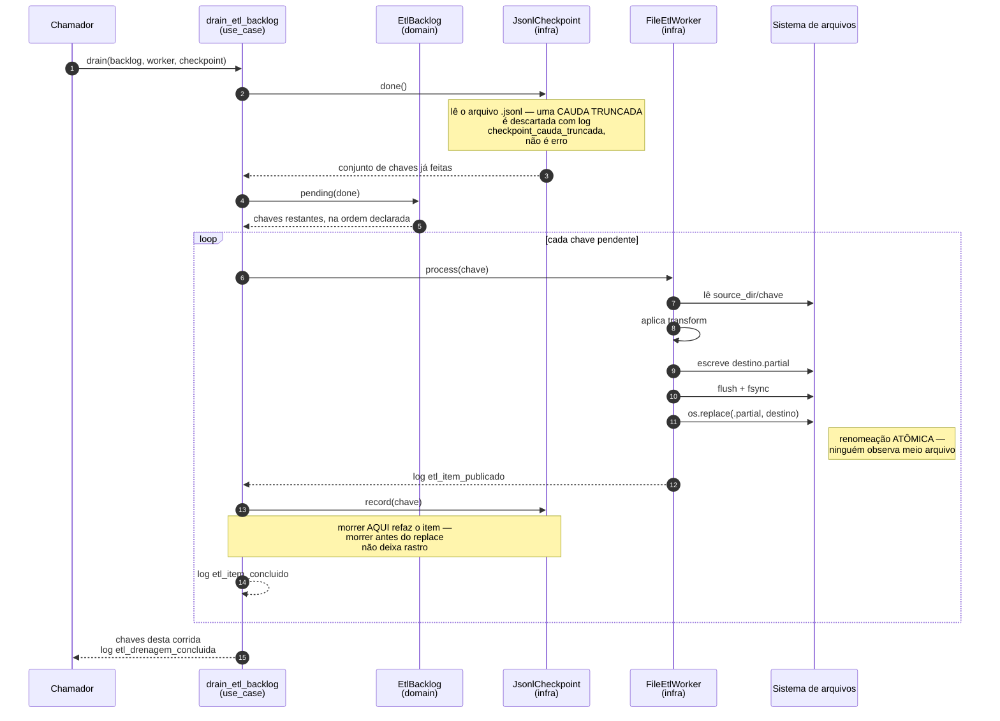
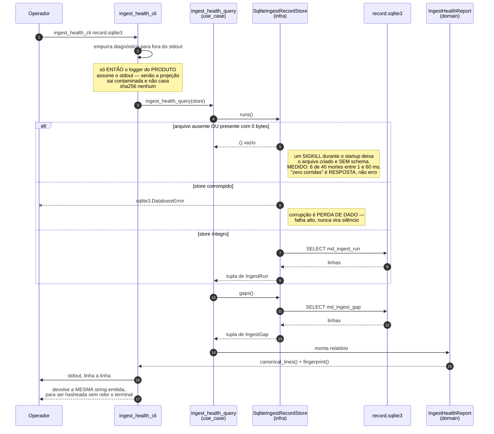
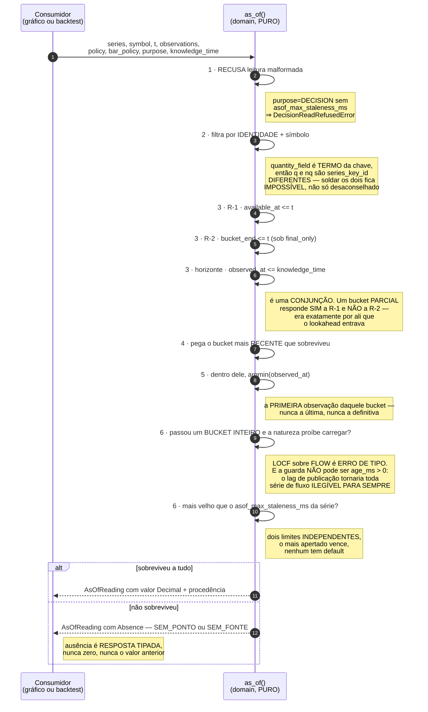

# Arquitetura do CÓDIGO — o que existe na árvore, medido

**Data:** 2026-08-30 · **Deriva de:** `master@840c500`, lido arquivo a arquivo
**Estado do ledger:** `plataforma-dados` em `BUILD_AUTHORIZED`, 2 de 9 fases com veredito

> ## ⚠️ Este documento é o par do [`arquitetura-fluxos.md`](arquitetura-fluxos.md), e a diferença é a razão de existirem dois
>
> | | [`arquitetura-fluxos.md`](arquitetura-fluxos.md) | **este documento** |
> |---|---|---|
> | deriva de | `SPEC-001` + `ADR-001..009` | **a árvore de código** |
> | escrito em | 2026-08-25 | 2026-08-30 |
> | responde | *"o que foi decidido"* | *"o que existe hoje"* |
> | quando divergirem | é **intenção** | é **fato** |
>
> **Ler um pelo outro é o defeito que os dois existem para evitar.** O primeiro mostra o contrato
> especificado; este mostra a árvore. Onde o desenho ainda não tem código, aqui aparece marcado —
> porque diagrama de arquitetura que põe caixa inexistente ao lado de caixa real é exatamente o tipo
> de instrumento que este repositório recusa.
>
> ⚠️ **E há uma linha do outro documento que envelheceu:** o cabeçalho dele diz *"Nada aqui está
> implementado. **Zero linha de código existe neste repositório.**"* Isso era **verdade em
> `2026-08-25`** e deixou de ser. Hoje são **4.986 linhas em 36 módulos**
> `[MEDIDO 2026-08-30 em 840c500: find backend/src -name '*.py' | wc -l → 36; wc -l → 4.986]`.
> A frase **não foi reescrita lá**: ela é registro do que era verdade, e apagá-la esconderia a
> linha do tempo. Este documento é a correção.

| legenda | significado |
|---|---|
| ✅ **existe** | está em `master`, com teste |
| ⛔ **não existe** | previsto na SPEC, sem código hoje |

---

## 0. Inventário — o que existe e o que não

| superfície | estado | o que há hoje | medida |
|---|---|---|---|
| **domínio** `domain/` | ✅ | identidade de série, procedência, acessor `as_of`, backlog, checksum, cotas | 15 módulos |
| **casos de uso** `use_cases/` | ✅ | ingest verificado, drenagem de ETL, registro F0, três sondas | 6 módulos |
| **infraestrutura** `infra/` | ✅ | SQLite, JSONL, arquivos, HTTPS, WebSocket cru, 3 CLIs | 12 módulos |
| **banco** `record.sqlite3` | ✅ | duas tabelas — *o registro da ingestão*, não o dado de mercado | 2 tabelas |
| **dado bruto** `data/` | ✅ | arquivos em disco, fora do git, catalogados em [`MANIFEST.md`](../data/MANIFEST.md) | 851 MB |
| **tabela de séries / observações** | ⛔ | `SeriesKey` e `SeriesRow` são tipos de domínio; **nada os persiste** | 0 tabelas |
| **API HTTP** | ⛔ | nenhum servidor, nenhuma rota — a saída é `stdout` de CLI | 0 endpoints |
| **aplicação de front** | ⛔ | sem React, sem bundler, sem `index.html`; 3 dos 4 arquivos são bancada de lint | 0 dependências |

**As duas ausências, medidas em vez de afirmadas:**

```bash
grep -rniE 'fastapi|flask|uvicorn|aiohttp|@app\.|@router|http\.server' backend/src
# rc=1 — nenhuma linha

python3 -c "import json; print(json.load(open('frontend/package.json'))['dependencies'])"
# {}

grep -rn 'def main(argv' backend/src
# infra/ingest_health_cli.py:117
# infra/quota_ramp_cli.py:241
# infra/aggtrade_nq_probe_cli.py:190
```

`[MEDIDO 2026-08-30 em 840c500]`

---

## 1. Containers

Tudo roda na máquina do owner. **Não há serviço, fila, cache nem broker** — e isso é decisão, não
pendência: a fase atual é de captura e registro, e o que ela precisa provar é que o dado entrou
íntegro e que a leitura não enxerga o futuro.



**O front está no diagrama porque a seta que falta é a informação.** Não há transporte entre ele e o
núcleo, e é isso que a fase `05` constrói.

---

## 2. Componentes do módulo `sentimento`

A regra de camada é verificada **por contrato, não por convenção**: `import-linter` reprova o build se
ela for quebrada. São três contratos, e um deles é sobre **natureza** — `domain` e `use_cases` não
podem importar `socket`, `ssl`, `time` nem `datetime`.

Isso não é purismo. Uma função que lê o relógio por dentro é **irreprodutível por construção**, e
`SPEC-001` §2.5 define `reproduzir(run)` por três valores declarados. Tempo entra como parâmetro —
`t`, `knowledge_time`, `bucket_interval_ms` — sempre.



```bash
make boundaries
# Camadas por contexto: infra > use_cases > domain          KEPT
# Fronteira de contexto: sentimento nao importa outro ctx   KEPT
# Natureza: domain e use_cases nao falam com socket, ssl    KEPT
# Contracts: 3 kept, 0 broken.
```

---

## 3. Fluxo — o dado entra pela borda verificada

Nenhum byte entra sem checksum conferido. A regra é **falha fechada**: sidecar ausente, sidecar
malformado, digest divergente e manifesto que atesta outro nome terminam todos com **zero linhas
entregues**.

O argumento está escrito no próprio módulo, e vale citar porque é a razão de a *ausência* do sidecar
ser recusa e não tolerância:

> *"Não conseguimos conferir" e "conferimos e está certo" são estados diferentes, e deixar o primeiro
> passar sob o nome do segundo é como um mês truncado entra sem ninguém notar. Um `200` com corpo
> truncado não levanta exceção nenhuma sozinho.*



⚠️ **`OSError` — arquivo sumiu, permissão negada — propaga cru, FORA da família de integridade.** É
decisão declarada, não sobra: dizer *"este arquivo está corrompido"* quando a verdade é *"o caminho
que você passou não existe"* confunde as duas perguntas que o módulo existe para separar. A
consequência é explícita: um chamador em lote escrito como
`except ChecksumRejectedError: pula_um_arquivo()` **pula objetos corrompidos e MORRE num caminho que
sumiu** — que é o comportamento que um lote deve ter, porque um payload que desapareceu no meio da
corrida significa que a visão de mundo do chamador está errada.

E há uma **assimetria** que a docstring nomeia em vez de esconder: a família de integridade carrega a
garantia de zero linhas; `OSError` **não**. Um `OSError` ao ABRIR (caso comum) dispara antes de
qualquer linha existir; um `OSError` no MEIO do stream, depois de o digest já ter casado, deixa no
sink as linhas aceitas até ali.

---

## 4. Fluxo — a fila de ETL que retoma sem duplicar

Duas garantias, e elas vêm de **lugares diferentes** — o que importa, porque confundi-las é como se
perde dado:

- **Nunca perde** vem da *ordem* `process → record`. Morrer entre as duas deixa o item pendente, e
  ele é refeito na retomada.
- **Nunca duplica** ***não*** vem daqui — vem do contrato de idempotência do `ItemWorker`, e por isso
  está escrito **na porta**, não no laço.



A tolerância à cauda truncada existe porque o processo **pode morrer no meio de uma escrita** — e um
checkpoint que se recusa a abrir depois de um `SIGKILL` transforma uma interrupção em perda total.

---

## 5. Fluxo — consulta do registro de ingestão (F0)

Esta é **a única consulta que existe hoje**, e ela não responde *"qual era o open interest às 14h"*.
Ela responde ***"o que foi capturado, o que faltou, e quanto disso é confiável"***.

A saída não é JSON de API — é uma **projeção canônica**: linhas ordenadas, ordem de colunas fixa, cujo
`sha256` é o identificador do relatório.



O `report()` devolve o que imprimiu **de propósito**: um relatório cuja saída só pudesse ser
inspecionada capturando um stream seria **um relatório que ninguém consegue falsificar**.

---

## 6. Fluxo — a leitura `as_of`, e por que ela é a mais cara do sistema

Este é o acessor **único** de série temporal. Ele responde uma pergunta específica: *qual era o valor
desta série, para este símbolo, **como ele era conhecível** no instante `t`* — não qual ele é hoje,
sabendo o que sabemos hoje.

A diferença entre as duas é **lookahead**, e é o defeito que arruína backtest. Este repositório já teve
**uma regra anti-lookahead invertida e propagada por dois documentos**; o acessor é a resposta a isso.



Duas decisões de assinatura que carregam peso:

- **`observations` é uma `Sequence`, não um handle de store — de propósito.** A função é pura, então a
  fixture envenenada de `SPEC-001` §5.1 é um literal de lista num teste em vez de um banco que precisa
  ser levantado, e **todo o mecanismo anti-lookahead é verificável offline**.
- **Valores são `Decimal`, nunca `float`.** `SPEC-001` §2.6 faz da aritmética decimal sobre a string
  crua da fonte parte do contrato, e um round-trip por `float` a desfaria **em silêncio no último
  passo do caminho que ela protege**.

---

## 7. A base: duas tabelas, e elas não guardam preço

O ponto mais fácil de errar sobre este sistema: **`record.sqlite3` não é o banco de dados de
mercado.** É o *registro da ingestão* — a prova de que uma captura aconteceu, o que ela pediu, o que
voltou, o que foi escrito e o que ficou faltando.

O dado de mercado vive como **arquivo em disco**, sob `data/`, com um `.CHECKSUM` ao lado.

### 7.1 `md_ingest_run` — uma linha por corrida de captura

| coluna | tipo | o que carrega |
|---|---|---|
| `run_id` **PK** | TEXT | identidade da corrida |
| `source` | TEXT | provedor — `binance`, `coinalyze` |
| `endpoint` | TEXT | rota exata consultada |
| `window` | TEXT | janela pedida — *aspeada no DDL: palavra reservada* |
| `n_expected` | INTEGER | quantos pontos a janela deveria render |
| `n_returned` | INTEGER | quantos o provedor devolveu |
| `n_written` | INTEGER | quantos sobreviveram à verificação |
| `verdict` | TEXT | conjunto **fechado**; valor desconhecido **reprova a leitura** em vez de esconder a corrida |
| `api_code` | INTEGER | código do provedor, quando houve — nulável |
| `src_sha256` | TEXT | digest do objeto capturado |
| `weight_used` | INTEGER | peso de cota gasto |
| `observer_id` | TEXT | quem observou |
| `observer_region` | TEXT | de onde — `unknown` é valor legítimo |
| `clock_skew_ms` | INTEGER | desvio de relógio no momento da captura |
| `started_at` | TEXT | armazenado, **nunca projetado** |
| `ended_at` | TEXT | armazenado, **nunca projetado** |

### 7.2 `md_ingest_gap` — uma linha por buraco detectado

| coluna | tipo | o que carrega |
|---|---|---|
| `source` **PK** | TEXT | provedor |
| `symbol` **PK** | TEXT | instrumento |
| `series_key_id` **PK** | TEXT | `sha256` da identidade de série — o elo com os 15 termos |
| `from_ts` **PK** | TEXT | início do buraco |
| `to_ts` **PK** | TEXT | fim do buraco |
| `n_missing` | INTEGER | quantos pontos faltam |
| `gap_class` | TEXT | classificação — *projetada como `class`*, palavra reservada em Python |
| `detected_at` | TEXT | quando foi percebido |

### 7.3 Escrita idempotente por construção

Os dois `INSERT` são `INSERT OR REPLACE`, e as chaves primárias são o que torna a retomada segura:
reprocessar a mesma corrida ou o mesmo buraco **converge para o mesmo estado**, em vez de multiplicar
linhas. Sob contenção de três escritores concorrentes, o teste mede que o resultado é
`ROWS_PER_WRITER` linhas — **não um múltiplo delas**.

### 7.4 A tabela projetada ≠ a tabela armazenada

O contrato de consulta difere do `CREATE TABLE` **nas duas direções**, e isso é deliberado:

- **só na tabela:** `started_at`, `ended_at` — guardados, nunca projetados;
- **só na projeção:** `janela_de_perda` — derivada, e **que na fase atual ainda não existe**. Ela
  aparece *ausente por declaração*, nunca como número inventado.

`janela_de_perda` é também a **exceção de idioma declarada** (`CLAUDE.md`, linha 11 da tabela de
fronteira): é nome de **coluna de contrato**, herdado de `ADR-008/D3`. A ordem das colunas alimenta o
`sha256` da projeção canônica — **reordenar a tupla muda a impressão digital de todo relatório já
emitido**. É mudança de contrato, não de estilo.

---

## 8. A identidade de série: 15 termos, e nenhum é decorativo

Duas séries com a **mesma** `SeriesKey` cujos valores acumulados divirjam significam que a chave está
incompleta. `SPEC-001` §1 guarda a prova de que isso **já aconteceu uma vez** neste projeto — foi o que
fez `quantity_field` virar termo.

| # | termo | # | termo | # | termo |
|---|---|---|---|---|---|
| 1 | `provider` | 6 | `interval` | 11 | `reduction` |
| 2 | `venue` | 7 | `unit` | 12 | `quantity_field` |
| 3 | `instrument_id` | 8 | `denom` | 13 | `label_shift` |
| 4 | `metric` | 9 | `nature` | 14 | `aggregation_scope` |
| 5 | `cohort` | 10 | `ts_convention` | 15 | `verified_by` |

E as **sete colunas de procedência** que toda linha de série carrega — elas são o que torna `as_of()`
possível:

| coluna | papel no caminho de leitura |
|---|---|
| `event_time` | quando o fato aconteceu no mercado |
| `available_at` | quando ficou disponível — a regra **R-1** |
| `availability_source` | como se sabe disso — medido ou inferido |
| `ingested_at` | quando entrou aqui |
| `observed_at` | quando *nós* observamos — o eixo do `argmin` e do horizonte de conhecimento |
| `provenance` | de onde veio |
| `src_label_raw` | o rótulo cru da fonte, preservado sem tradução |

> ### ⏸ Aberto, com dono declarado
>
> `verified_by` está **dentro** dos 15 termos, então renomear o teste que mediu `label_shift`
> **re-identifica a série**. E `SPEC-001` lista o termo **duas vezes** — como termo da chave em §2.1 e
> como metadado de catálogo em §3.3. **As duas leituras não valem juntas.** Decisão do `/architect`;
> o custo já está fixado por teste.

---

## 9. Endpoints expostos ao front

**Nenhum.** Não é que estejam incompletos — **não existe camada de transporte**. A medição está na §0.

O que existe de "interface" são **três CLIs**, e a saída de produto delas é `stdout`:

| CLI | invocação | devolve |
|---|---|---|
| `ingest_health_cli` | `<caminho do store>` | projeção canônica do registro F0, linha a linha, hasheável |
| `quota_ramp_cli` | `headers` · `coupling <n>` · `ramp <balde> <máx>` | medição de cota e de acoplamento de balde nos três provedores |
| `aggtrade_nq_probe_cli` | argumentos de sonda | se o stream `@aggTrade` carrega o campo `nq` |

E há **um comando de front que roda hoje**, embora não produza tela:

```bash
npm --prefix frontend run spike:axis
# constrói um gráfico Lightweight Charts REAL, com 1.728 pontos, via jsdom
# saída: números, não pixels

# Cenario A — grade de 1 m completa
#    PIOR CASO : 2.27e-13 px   (tolerancia D8.19 = 0.500 px)
# Cenario B — cobertura de 1 m em 20.0% (o numero que D8.11 ja media)
#    PIOR CASO : 36.390 px     (73x a tolerancia)
```

---

## 10. A jornada do front — e o que está entre o owner e a primeira tela

A fase `05` da SPEC é quem constrói a interface: **7 tasks de `charts` e 3 de `web`**. O desenho
previsto está em [`arquitetura-fluxos.md`](arquitetura-fluxos.md) §4 — `knowledge_time` na URL, o
*bundle* sendo a própria URL em vez de um CRUD, transporte HTTP endereçável por conteúdo para o
histórico, e o selo de quatro campos visível sem *hover*.

**Nada disso começou, e o motivo não é técnico — é de contabilidade:**

| # | elo da cadeia |
|---|---|
| 1 | a pergunta **`Q1`** segue sem resposta do owner — classificada *capture-or-lose*, sem mitigação de engenharia |
| 2 | `T-02.1` e `T-02.2` continuam `blocked` por causa dela |
| 3 | `harness gate-record` recusa com **`rc=4`**: *"3 de 5 tarefas da fase 02 em estado não-terminal"* |
| 4 | sem evidência no ledger, `harness tasks resolve` não tem o que copiar |
| 5 | **`T-04.4`** — mergeada, QA `APPROVED`, review `COMPLIANT` — permanece `todo` no `tasks.toml` |
| 6 | e `T-04.4` gateia **23 das 25 tasks de front** |

> **O código está pronto; o registro é que não pode fechar.** Cinco vereditos medidos e aprovados
> estão hoje **fora do ledger** pelo mesmo motivo — `T-04.2` review, `T-08.2` QA e review, `T-04.4` QA
> e review. Nenhum agente usou `pipeline override`: é escape do owner, e usá-lo por conveniência
> apagaria a diferença entre *"a fase 02 fechou"* e *"alguém contornou o portão"*.

Respondida a `Q1` — ou dado o *override* — **três tasks de front abrem na hora** (`T-05.1`, `T-05.8`,
`T-05.9`), e a `T-05.1` abre mais cinco.

### 10.1 Um risco que a interface vai herdar, já medido

O *spike* da `T-08.2` mediu que **o eixo do Lightweight Charts indexa por posição ordinal do slot, não
por `event_time`**. Sobre grade completa as duas funções coincidem — daí o zero-de-float do cenário A.
Com buracos, divergem.

E a cobertura de 20% **não foi escolhida para produzir o achado**: é o número que o próprio plano `08`
já media para o *timeframe* de 1 minuto (`D8.11`). Sobre cinco sementes, **todas as cinco reprovam**,
entre `13,664` e `36,390 px` — a magnitude depende da forma dos buracos, a reprovação não.

A consequência para as **16 tasks de `charts`** construídas sobre essa premissa: ou a grade entregue ao
gráfico é **completa e uniforme**, com buracos preenchidos por *whitespace*, ou **a posição X não pode
ser lida como tempo**. Decisão de arquitetura, dono `/architect`, ainda em aberto.

---

## 11. Como manter este documento honesto

Este documento **deriva da árvore**, então ele envelhece a cada merge — que é exatamente o defeito que
o cabeçalho aponta no `arquitetura-fluxos.md`.

**O falsificador, e ele é barato:** os números da §0 são todos comando. Se algum deles divergir do que
está escrito aqui, o documento está velho e a correção é re-medir, não estimar.

```bash
find backend/src -name '*.py' | wc -l                      # módulos       (aqui: 36)
find backend/src -name '*.py' -exec cat {} + | wc -l       # linhas        (aqui: 4.986)
grep -c 'CREATE TABLE' backend/src/modules/sentimento/infra/sqlite_ingest_record_store.py
                                                            # tabelas       (aqui: 2)
grep -rn 'def main(argv' backend/src | wc -l               # CLIs          (aqui: 3)
grep -rniE 'fastapi|flask|uvicorn|aiohttp|@router' backend/src | wc -l
                                                            # endpoints     (aqui: 0)
```

**A regra que este repositório aplica a si mesmo vale aqui:** nenhum número sem o comando que o
produziu, com o universo e o rótulo de força.
