# Arquitetura em diagramas — os quatro fluxos

**Data:** 2026-08-25 · **Deriva de:** [`SPEC-001`](specs/SPEC-001-plataforma-dados.md) (`DRAFT`) e [`ADR-001`..`ADR-009`](adr/)
**Estado do ledger:** `SPEC_DRAFT` — **o gate `spec` é do owner e não foi dado.**

> ## ⚠️ Leia isto antes dos diagramas
>
> **Nada aqui está implementado. Zero linha de código existe neste repositório.** O que os diagramas
> mostram é o **contrato especificado**, não um sistema em operação. Onde um caminho está **decidido**,
> o diagrama é sólido; onde está **deferido** ou é **non-goal desta fase**, o diagrama diz isso na
> própria caixa. **Diagrama que não distingue as duas coisas é o mesmo defeito que este projeto passou
> três rodadas corrigindo:** apresentar decisão onde há intenção.

| legenda | significado |
|---|---|
| linha cheia | caminho **decidido** em SPEC/ADR |
| linha tracejada | **deferido**, **aberto** ou **non-goal desta fase** |
| `⛔` | bloqueado por pergunta do owner em aberto |
| `[NÃO MEDIDO]` | número que falta para fechar a decisão |

---

## 0. Visão geral — e a fronteira que é a razão de a plataforma existir

**Nenhuma superfície chama endpoint de exchange direto.** Tudo lê o store local, **inclusive `OI (agora)`**,
que é série ingerida como qualquer outra — senão os quatro campos do selo ficam impreenchíveis
([`SPEC-001` §4.1](specs/SPEC-001-plataforma-dados.md)).

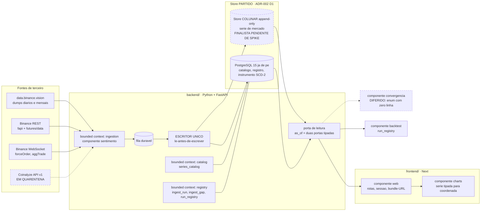

**Duas coisas neste desenho são decisões, não desenho:**

- **O store é partido** ([`ADR-002`](adr/ADR-002-motor-de-armazenamento.md) D1), e isso fecha a alternativa
  *"um motor para tudo"* — que era a forma implícita em que a pergunta vinha sendo feita, e é falsa. Catálogo,
  registro e instrumento são **OLTP de verdade** (SCD-2, chave estrangeira, unicidade forte, leitura pontual) e
  vão para o `postgres:15` **que já está de pé** ⇒ zero container novo. A série é **OLAP puro** (append-only,
  varredura sequencial de backtest, agregação por bucket) e vai para store colunar.
- **A escrita é fan-in de escritor único** ([`SPEC-001` §4.2](specs/SPEC-001-plataforma-dados.md)), e isso é
  **contrato, não preferência**: duas invariantes exigem **ler antes de escrever**, e elas vivem na aplicação
  em **qualquer** dos cinco motores candidatos.

---

## 1. A estrutura de dados

### 1.1 A identidade — `SeriesKey`, 15 termos

Não existe "o OI". Existe uma série com identidade completa, e **pedir `OI` sem `reduction` é erro, nunca
default** — a Coinalyze devolve OI como **OHLC do bucket**, não como ponto, o que dá **quatro linhas de
catálogo, não três**.

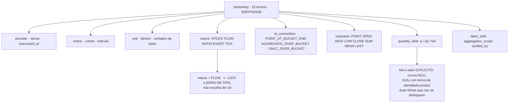

### 1.2 As sete colunas de procedência — em toda linha de série

Elas são o que separa esta plataforma de um dump de CSV. **Faltando qualquer uma, a linha é inválida.**

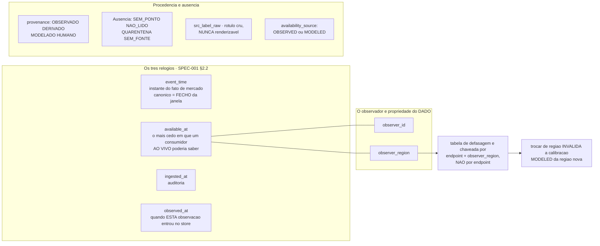

**Por que `observer_region` é urgente e não cosmético:** os dumps vivem em `ap-northeast-1`. Um host em São
Paulo e um em Tóquio produzem `available_at` **sistematicamente diferentes**. É **coluna de F0, impossível
retroativamente** — e a região da VPS está `[NÃO MEDIDO]`.

### 1.3 As duas invariantes de armazenamento que quase tudo deriva

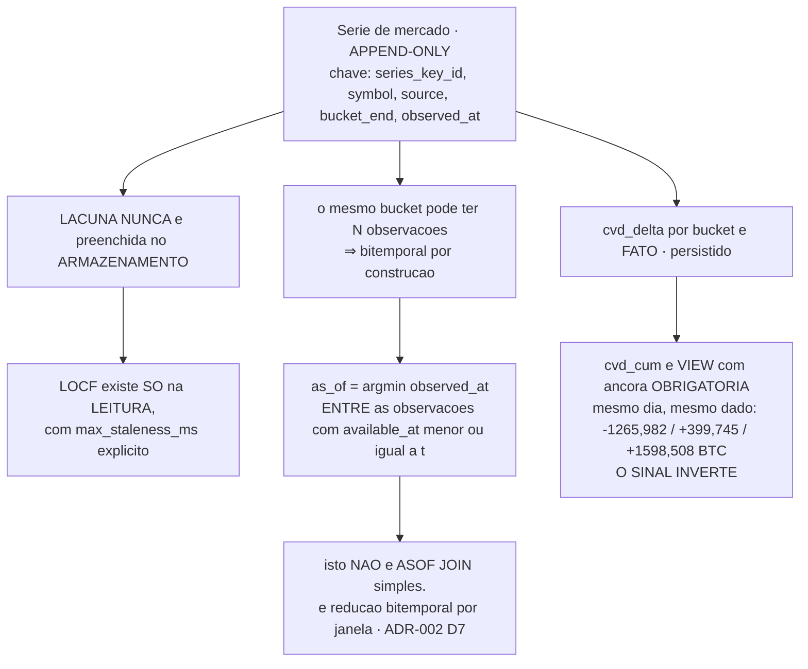

### 1.4 A quarentena — predicado de três termos, e ele não se abre com dois

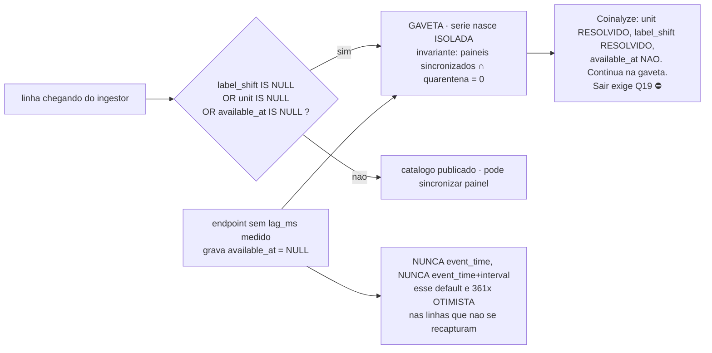

---

## 2. Ingestão

### 2.1 O fluxo

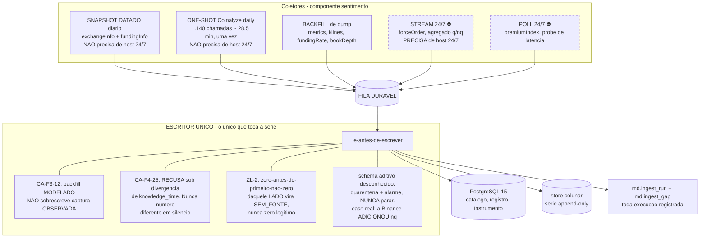

**O gate de F0 é declarado POR COLETOR, e é por isso que `CST-2` é partido em duas fases.** O snapshot diário
e o one-shot da Coinalyze **não precisam de `Q2`** — são um `GET` mais `gzip`. Os contínuos precisam.

### 2.2 O que a ingestão tem de decidir em cada linha, e onde ela erra em silêncio se não decidir

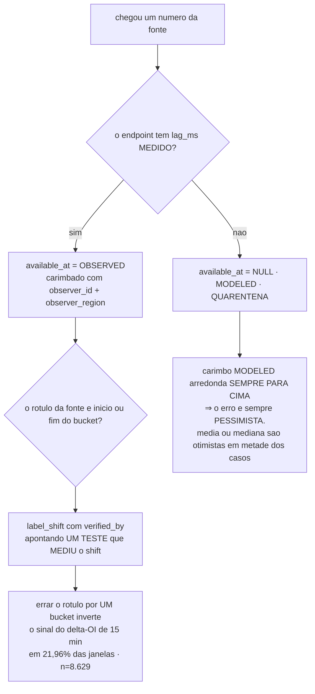

### 2.3 ⛔ O fato capture-or-lose que esta rodada descobriu: `CL-5`

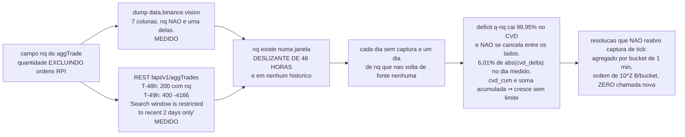

---

## 3. Análise de estratégia e convergência

> ### ⚠️ Isto é **non-goal declarado desta fase**, e o diagrama existe para mostrar **a porta**, não o mecanismo
>
> O componente `convergencia` existe no vocabulário fechado com **zero linha**. São non-goals explícitos:
> limiar numérico de sinal · matriz de convergência · regra de entrada/SL/TP · métrica de performance ·
> **detectores SMC** (OB, FVG, BSL/SSL, BOS/CHoCH) · **detectores de pivô e níveis de Fibonacci** · critério
> de match · walk-forward · paper trading · execução ao vivo.
>
> **Nomear o vocabulário não move a fronteira.** `Q20` — SMC × pivôs+Fibonacci × os dois — está **aberta**, e
> ela decide o que a fase **seguinte** detecta.

### 3.1 O que esta fase entrega para que a próxima não seja migração

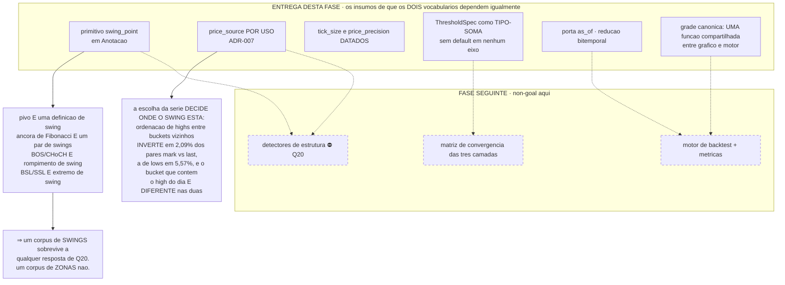

### 3.2 A tese em três camadas, e o que dela já tem dado contratado

A tese declarada pelo owner ([`direcionamento-operacional.md`](direcionamento-operacional.md)) é confirmação
cruzada de três camadas, em **15m / 1h / 4h**, com decisão **no fechamento do bucket**.

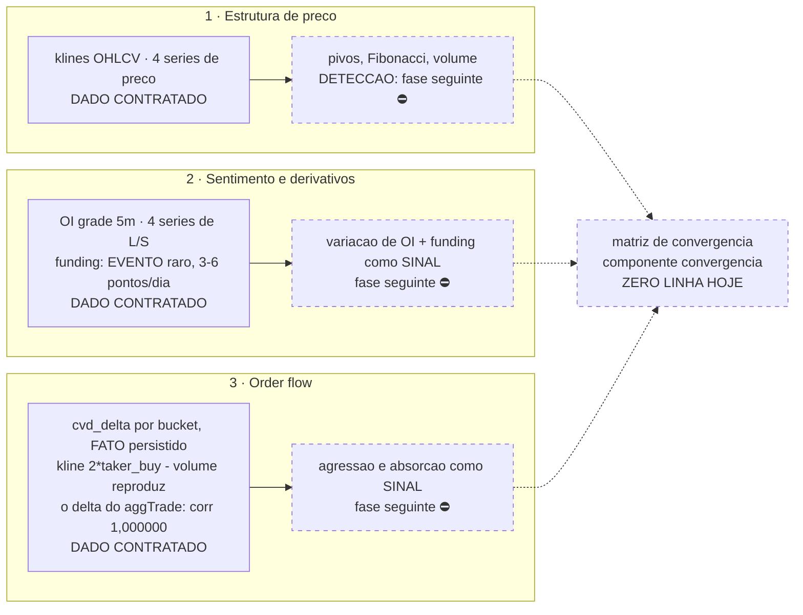

**Detalhe medido que muda o desenho:** o funding é **evento raro** (3–6 pontos/dia) e exige **trilho de
evento**, não série contínua. E a cobertura de OI por barra é **1,0 em 5m · 3,0 em 15m · 12,0 em 1h · 48,0 em
4h** — nos prazos declarados, toda barra tem OI, o que dissolveu o problema que dominou a rodada de UX.

---

## 4. Fluxo para exibir o gráfico — consultas e telas

### 4.1 As cinco superfícies

| superfície | job | fase | componente |
|---|---|---|---|
| **S1** console de coleta e retenção | *o que está sendo gravado, o que parou, quanto disso é perda permanente* | F3 | `web` |
| **S2** símbolo — multi-painel, replay as-of, marcação | *olhar uma série contra o preço e afirmar o que ela significa* | mínima em F1, completa em F4 | `charts` + `web` |
| **S3** inspetor de série | *o que este número é, e quais linhas exatas o produziram* | F2 | `web` |
| **S4** bancada de distribuição | *que taxa de disparo um limiar produziria — antes de escolher o limiar* | F4 | `charts` + `web` |
| **S5** universo point-in-time | **não é tela**: `universe_at(ts, filtro)` atrás de todo seletor | F3 | `sentimento` |

### 4.2 As duas rotas de transporte — por classe de tempo

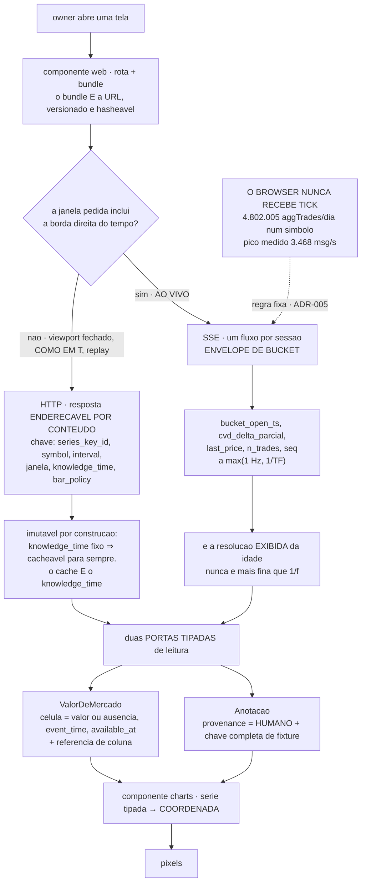

### 4.3 O içamento — por que o envelope não vai na célula

**Medido: envelope completo por célula custa 519 B contra 54 B (9,6×)** ⇒ na tela de 570×6, **1.733 KB contra
180 KB**. E o envelope repetido por célula é a forma de o mesmo `SeriesKey` ser afirmado **3.420 vezes por
tela**, o que não é informação.

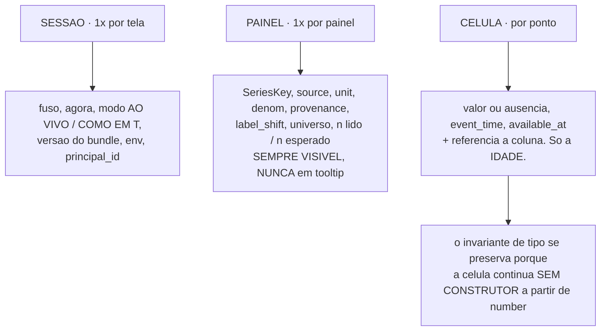

### 4.4 O selo — quatro campos, sem hover

**Nenhum numeral de mercado renderiza sem selo, visível sem hover. Tooltip não conta.**

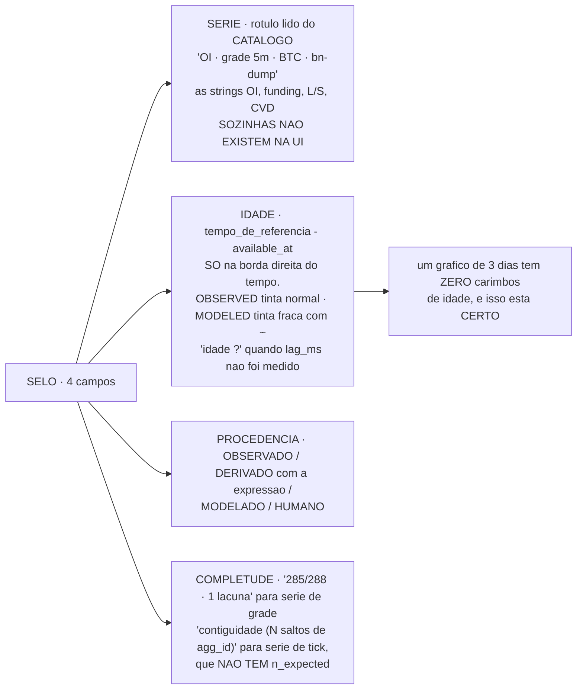

### 4.5 A fronteira `charts` ⇄ `web` — decidível por inspeção

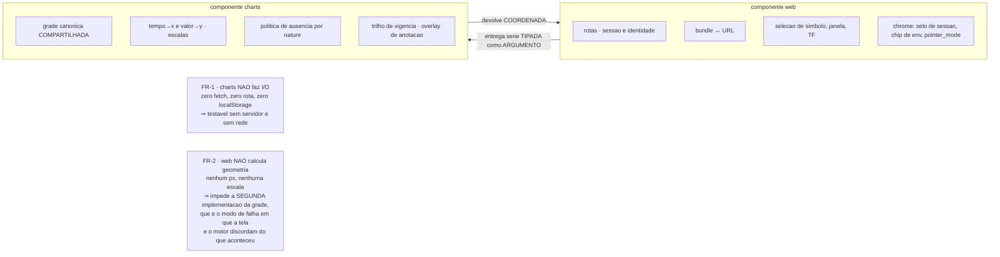

### 4.6 Reprodutibilidade — o que garante que a tela e o motor contem a mesma história

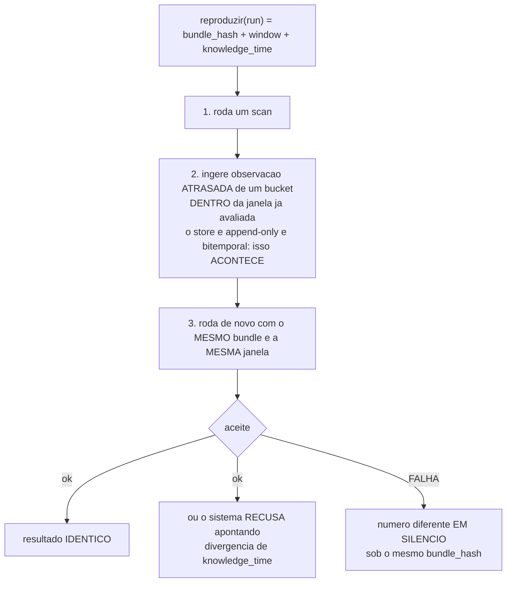

---

## 5. Alertas

> ### ⚠️ **Não existe canal de alerta, e isso é uma pergunta aberta do owner — `Q3`.**
>
> O owner disse que a ausência de alertas não é impeditivo. Concordo que não gateia a fase — **mas há um
> detalhe que muda a conclusão**, e ele já está registrado na SPEC: *"coletor parado"* é **P1 com orçamento de
> 24 h**, e o dado que ele deixa de capturar é da classe que **não se recaptura**. Um alerta que depende de uma
> aba aberta não é alerta: **tela fechada não avisa ninguém.**

### 5.1 O que existe hoje, e o que é o buraco

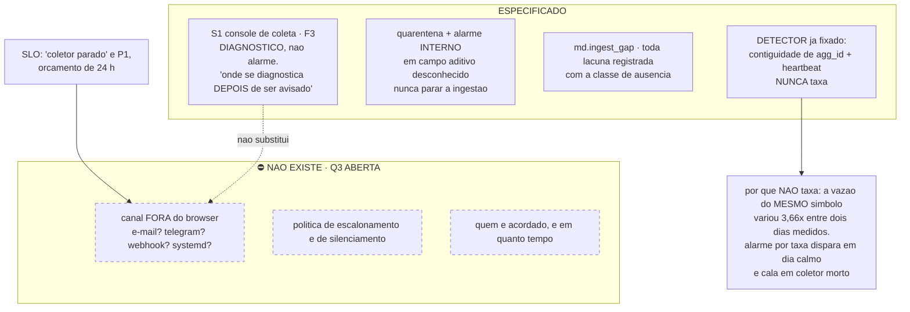

**O que já está decidido e é a parte difícil:** o **detector**. Alarme por taxa é a armadilha óbvia e está
proibida com número — a vazão do mesmo símbolo variou **3,66×** entre dois dias, então um limiar de taxa
dispara em dia calmo e **cala em coletor morto**. O que sobra é **contiguidade de `agg_id` + heartbeat**, que
detecta parada real sem falso positivo de mercado quieto.

**O que falta é só o transporte da notificação** — e é isso que `Q3` pergunta.

---

## 6. Onde cada fluxo está bloqueado

| fluxo | estado | bloqueio |
|---|---|---|
| **Ingestão** — snapshot datado, one-shot Coinalyze, backfill de dump | especificado, **sem bloqueio de owner** | `Q1` para ligar |
| **Ingestão** — coletores contínuos (`forceOrder`, agregado `q`/`nq`, probe) | especificado | ⛔ `Q1` + `Q2` + `Q19`, e **`Q17`** para spread |
| **Estrutura de dados** — contrato temporal e identidade | especificado, **offline, sem rede, sem chave** | nenhum |
| **Gráfico** — S2-mínima | especificado | ⛔ `Q16` |
| **Gráfico** — S1, S3, S4, S2 completa | especificado | ⛔ `Q3`, `Q10`, `Q11`, `Q13`, `Q18` |
| **Motor de armazenamento** — finalista | **deferido a spike, com 5 critérios declarados antes** | `free -m` · `df -h` · região `[NÃO MEDIDO]` |
| **Estratégia e convergência** | **non-goal desta fase** | ⛔ `Q20` decide a fase seguinte |
| **Alertas** | **não existe** — detector fixado, transporte não | ⛔ `Q3` |

---

## 7. Procedência

Todo diagrama acima deriva de documento deste repositório, não de desenho novo:

| diagrama | fonte |
|---|---|
| §0 visão geral, §1.1–1.4 estrutura de dados | [`SPEC-001`](specs/SPEC-001-plataforma-dados.md) §2, §3, §4.1, §4.2, §5.2, §5.3 |
| §2 ingestão | [`SPEC-001`](specs/SPEC-001-plataforma-dados.md) §1.4, §4.2, §5.3, §5.6 · [`ADR-008`](adr/ADR-008-registro-cru-de-f0.md) · plano [`02`](plans/SPEC-001-plataforma-dados/02_captura_sem_gate_de_host.md), [`03`](plans/SPEC-001-plataforma-dados/03_captura_continua.md) |
| §2.3 `CL-5` (a janela de 48 h) | [`SPEC-001`](specs/SPEC-001-plataforma-dados.md) §1.4 · **e re-medido em 2026-08-25** (ver abaixo) |
| §3 estratégia e convergência | [`SPEC-001`](specs/SPEC-001-plataforma-dados.md) §3.6, §3.7, §4.1 · [`PRD-001`](specs/PRD-001-plataforma-dados.md) §12 · [`direcionamento-operacional`](direcionamento-operacional.md) |
| §4 gráfico | [`ADR-003`](adr/ADR-003-fronteira-charts-web.md) · [`ADR-005`](adr/ADR-005-transporte-de-leitura.md) · [`ADR-006`](adr/ADR-006-max-staleness-por-serie.md) · [`ADR-007`](adr/ADR-007-price-source-por-uso.md) · [`SPEC-001`](specs/SPEC-001-plataforma-dados.md) §6, §7 |
| §5 alertas | [`SPEC-001`](specs/SPEC-001-plataforma-dados.md) §9 (`Q3`) · plano [`07`](plans/SPEC-001-plataforma-dados/07_aquisicao_em_regime.md) |
| §0/§1 store partido | [`ADR-002`](adr/ADR-002-motor-de-armazenamento.md) D1–D7 · [`premissas-de-infra-e-stack`](premissas-de-infra-e-stack.md) |

**Verificação independente da janela de 48 h de `nq`, feita para este documento:**

```
$ head -1 data/binance/aggtrades/BTCUSDT-aggTrades-2026-08-20.csv
agg_trade_id,price,quantity,first_trade_id,last_trade_id,transact_time,is_buyer_maker   # 7 colunas, sem nq

$ curl "…/fapi/v1/aggTrades?symbol=BTCUSDT&limit=5&startTime=<T-48h>&endTime=<+5min>"
200 · campo "nq" presente
$ curl "…&startTime=<T-49h>…"
400 · {"code":-4166,"msg":"Search window is restricted to recent 2 days only."}
```
